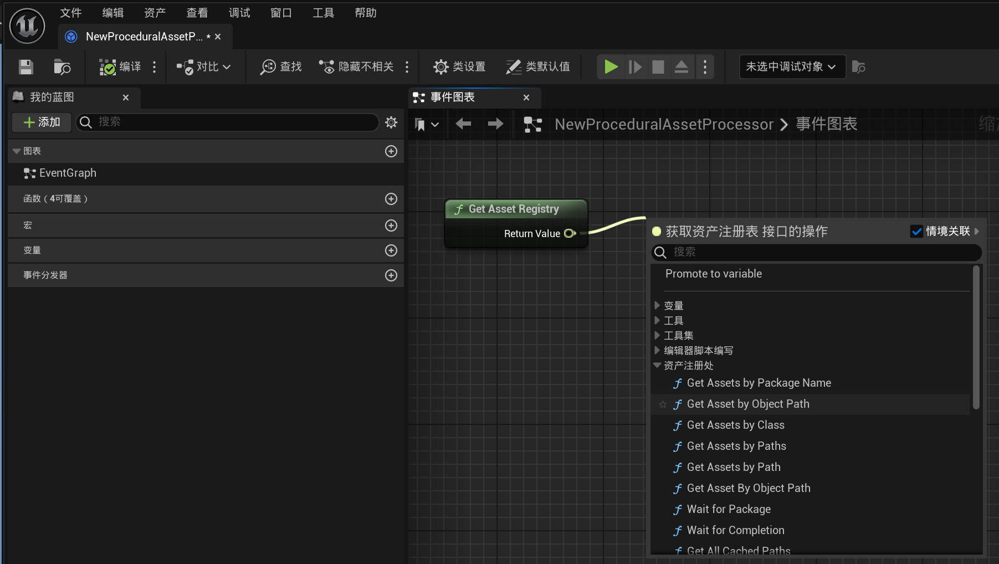
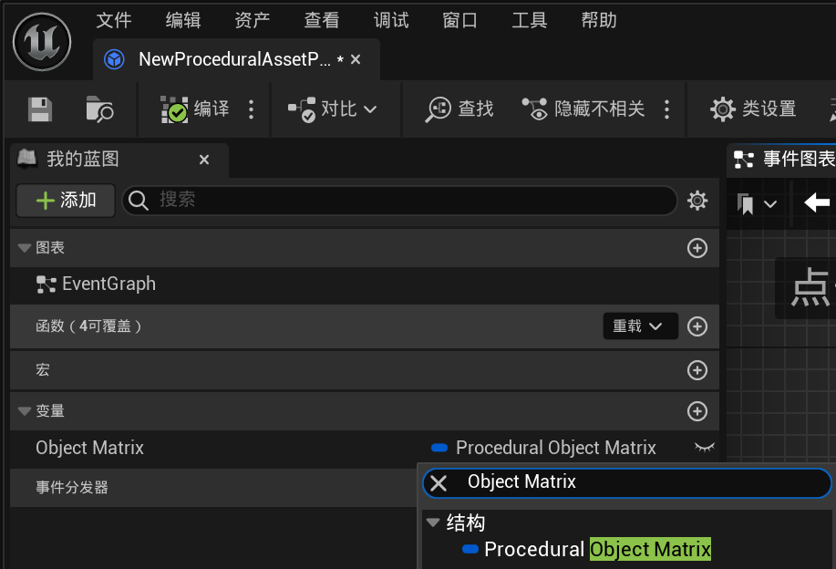
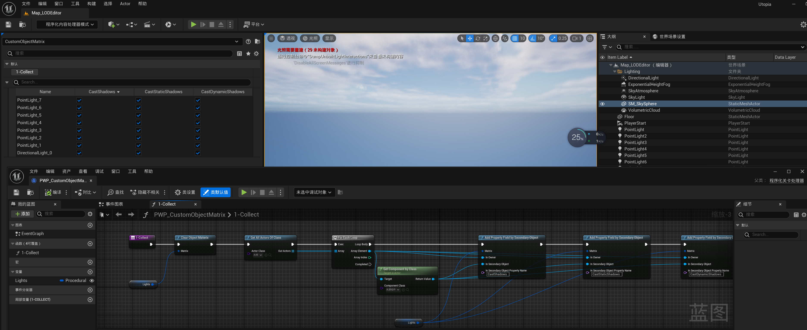

# Procedural Content Processor
**Procedural Content Processor** 是一个小巧的 Unreal Engine 插件，它旨在以程序化的方式来管理引擎中的内容（对象，资产，Actor）。

如果希望通过编写逻辑来管理项目内容，而不是只能通过编辑器点点点，那么这个插件正是你想要的。

- 仓库地址：https://github.com/Italink/ProceduralContentProcessor （目前只保证了 UE 5.4 + 的编译构建）

> 这个插件花费了笔者不少的时间去迭代，它本身只是一个基础框架，对于一些可用的公共接口，您可以在Github上Fork一个独立的仓库，参与到该仓库的贡献哦~

## 功能说明

它的主要功能如下：

- **提供统一的编辑器工具入口**，接口简单，可以快速扩展：

    

- **支持自定义对象的筛选规则，允许预览和编辑关键属性**。试想一个这样的应用场景：场景中存在大量由美术人员放置的灯光，通过追踪我们发现似乎是因为某盏灯的阴影绘制耗时过高，为了找到问题来源，通常的手段可能是在大纲中一个个点击光源，再逐个打开它的细节面板，检索是否存在异常的参数，而这个操作是极其繁琐的。

    

- **支持自定义的DebugView，Actor着色**

- 提供 **常用的编辑器操作接口** ，如用户提示（消息盒子，通知气泡，任务进度预览...），对象操作接口（对象拷贝，删除，事务，重定向，合并，引用查询...），模型编辑（LOD修改，轴心修正），材质节点查询...

## 使用说明

**Procedural Content Processor**  提供了三个可用的资产：

- **程序化资产处理器（ProceduralAssetProcessor）**：用于编写资产操作相关的编辑器工具
- **程序化关卡处理器（ProceduralWorldProcessor）**：用于编写关卡处理相关的编辑器工具
- **程序化Actor着色器（ProceduralActorColorationProcessor）**：用于编写Actor调试着色策略

### 基本用法

**Procedural Content Processor** 本身并没有提供大多复杂的功能，它大多是依托于引擎的原生功能。

一个关键点是：

- 勾选了 **CallInEditor（在编辑器中调用）** 的蓝图函数（或是`UFUNCTION`中具有`CallInEditor`标识符的C++函数），会在对象的细节面板上生成相应的按钮，点击该按钮，将会执行对应的函数逻辑：

以此为契机，我们可以编写大量的编辑器工具。

程序化内容处理器的一些蓝图配置将会影响到编辑器大纲的显示：

- **Sort Priority**：排序优先级，影响编辑器大纲中下拉框的排序。
- **Document Hyperlink**：该处理器的文档链接，点击编辑器大纲上的 【? 按钮】将打开对应的网址。
- **Override UMGClass**：使用UMG控件顶替默认的细节面板，一般用于自定义编辑器的UI。
- **蓝图显示名称**：该处理器在编辑器大纲中的真实显示名称。
- **蓝图描述**：该处理器在编辑器大纲中的提示信息。
- **蓝图命名空间**：该处理器在编辑器大纲中的分类，多级分类以`.`隔开。

蓝图属性中的一些配置会对细节面板有所影响：

- **可编辑实例**：只有勾选了可编辑实例的属性，才能在对象的细节面板上编辑，否则只能在蓝图编辑器中修改默认值。
- **只读蓝图**：勾选后，该属性将变得不可编辑，但会预览。
- **配置变量**：勾选后，该属性的值将会被存到配置文件中，下次启动处理器时会读取之前的配置。

程序化内容处理器拥有四个可覆写的基本事件函数：

- `void Activate()`：处理器激活时调用。
- `void Tick(DeltaTime)`：处理器激活后，每帧调用。
- `void Deactivate()`：处理器退出时调用。
- `void PostEditChangeProperty(PropertyName)`：处理器属性变更时调用。

对于C++而言，可以覆写如下函数来深度定制编辑器：

- `TSharedPtr<SWidget> BuildWidget()`

UE的细节面板非常强大，通过 **属性 + 函数** 的方式我们可以快速搭建出简单易用的编辑器：

### 资产处理

对于 **程序化资产处理器（ProceduralAssetProcessor）**，可以在自己的编辑器函数中调用 `GetAssetRegistry()` 函数获取到资产注册表，从而操作资产。

### 关卡处理

对于 **程序化关卡处理器（ProceduralWorldProcessor）**，可以在自己的编辑器函数中调用 `GetAllActors...()` 函数来搜集Actors，筛选后执行自定义逻辑。

### Actor着色

对于 **程序化Actor着色器（ProceduralActorColorationProcessor）** ，多了一个可覆写的事件函数：

- `FLinearColor Colour(PrimitiveComponent)`

### 对象编辑矩阵

UE提供了一个 **属性矩阵** 的功能可以批量更改资产的某些属性：

**Procedural Content Processor** 在它的基础上，支持以程序化的方式来构建任意对象（UObject）的属性编辑矩阵。

我们只需要在蓝图中添加一个 **Procedural Object Matrix** 类型的成员变量：

在自己的编辑器函数中调用如下接口就能构造对象属性矩阵，它会显示在对象的细节面板上：

- `void ClearObjectMaterix()`：清理对象矩阵
- `void AddTextField(Owner, FieldName, FieldValue)`：添加简单的预览文本，意味着`{Owner}`行，`{FieldName}`列，将被填充为`{FieldValue}`
- `void AddPropertyField(Owner，PropertyName)`：添加属性编辑器，意味着`{Owner}`行，`{PropertyName}`列，将被填充为 【Owner对象PropertyName属性】的编辑器。
- `void AddPropertyFieldBySecondaryObject(Owner，SecondaryObject，SecondaryObjectPropertyName)`：添加属性编辑器，意味着`{Owner}`行，`{SecondaryObjectPropertyName}`列，将被填充为 【SecondaryObject对象SecondaryObjectPropertyName属性】的编辑器。

这是引擎中的一个使用示例：

### 其他

**UProceduralContentProcessorLibrary** 中提供了许多常用的编辑器函数，对于引擎未暴露给蓝图的编辑器接口，可以统一放置在这里：

